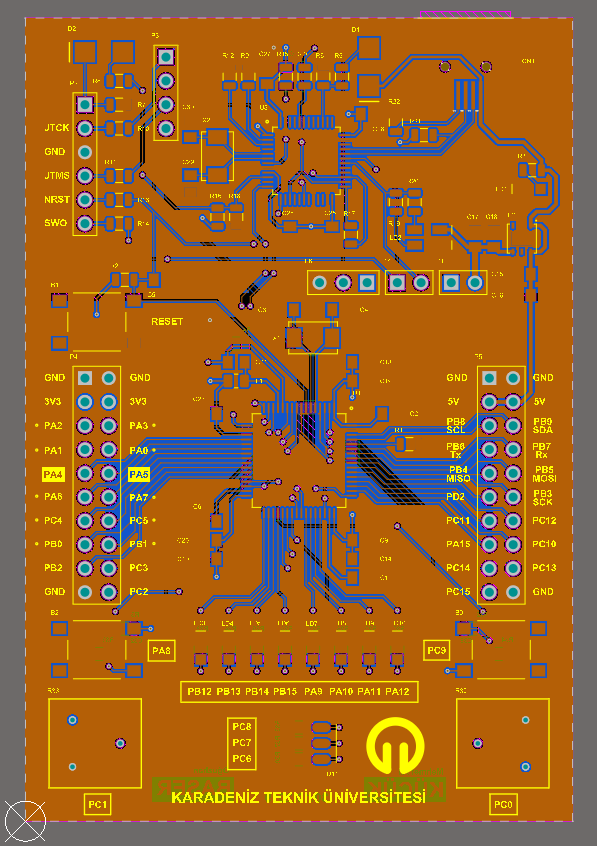

# STM32F415 Geliştirici Kartı

Karadeniz Teknik Üniversitesi' nde hocamız Prof. Dr. İsmail KAYA' nın danışmanlığında gerçekleştirdiğimiz devre kartımızın Altium çizim dosyalarını paylaştık. Bu geliştirici kartı ile ST' nin verdiği NUCLEO kartlarında olduğu gibi ek bir ST-Link gerekmeden USB kullanarak programlama, debug ve seri port bağlantısı gerçekleştirilebilmektedir. ST-Link' in yüklenebilmesi için gerekli adımlara [bağlantıdan](http://www.mehmetalikucuk.com/) ulaşabilirsiniz.

Bu çalışmayı beraber gerçekleştridiğim bağlantıdaki sitenin sahibi Arş. Gör. Mehmet Ali KÜÇÜK hocama da ayrıyeten teşekkür etmek isterim.

 Merkez işlemci olarak STM32F415 kullanılmıştır. ST-Link kısmında ise STM32F103CBT6 kullanılmıştır. ST-Link için seçilen işlemcinin 128kb hafızaya sahip olması önemlidir. 64kb hafızalı olan modeline ST-Link' in yeni Firmware' ni yüklemeniz hafıza yetersizliğinden mümkün olmayacaktır. 

 Tasarlanan geliştirici kartının özellikleri:
- 8 adet LED
- 2 potansiyometre
- 1 RGB LED (Timer kanallarına bağlı)
- Dahili ST-Link V2.1 (Sanal COM Port ve yığın bellek)
- 2 DAC
- 2 CAN (1 Master, 1 Slave)

Devrenin görüntüsü aşağıdaki gibidir.

</img>
</img>
